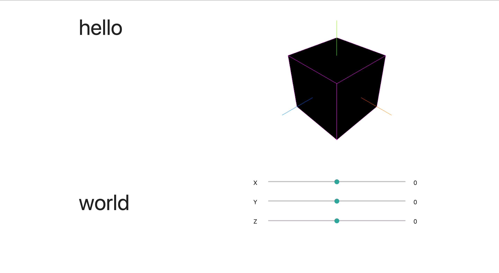

# THREE-js-Simple-Example

A simple cube object in a css container with sliders for x, y, z axis.

Code is well commented and is a good place to start when learning THREEjs.

It took me a few hours to get this far because I have never done anything with 3D models. I figured I would share it to help someone else!

Hope this helps you! 



## About
 
A generic express-js server with the bare minimum code for easy understanding.

**Files to look at are:** 
- **views/index.jade** --> *html*
- **public/javascripts/cube.js** --> *logic*

## Installation 

```bash
git clone https://github.com/robertIanClarkson/THREE-js-Simple-Example.git
cd THREE-js-Simple-Example
npm install
```

## Running

In Terminal:
```bash
npm start
```

In Your Browser (Chrome or Firefox):
```
http://localhost:3000/
```
OR
```
http://127.0.0.1:3000/
```

## Contributing
Pull requests are welcome. For major changes, please open an issue first to discuss what you would like to change.

Please make sure to update tests as appropriate.

## License
[MIT](https://choosealicense.com/licenses/mit/)
